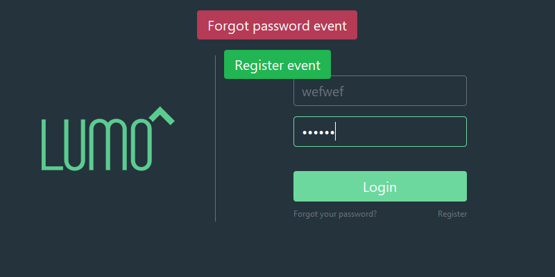
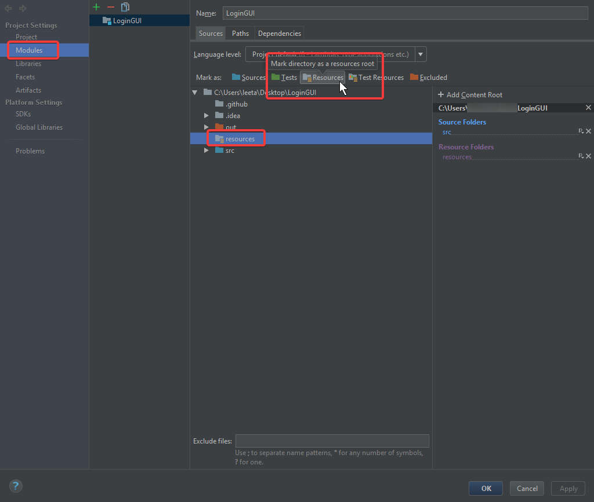

# Swing Login GUI With Toast

## Description

I created this project, because I was sick of how Swing GUIs typically look. In my opinion, this is a much more user-friendly UI than anything I've seen online. Enjoy!

## Examples:
**Screenshot:**



**Event Handler Video:**


## Code Examples:
```java
private final Toaster toaster = new Toaster(mainJPanel);

toaster.error("An error event!!", "Or multiple at once");
toaster.warn("A warning event!", "Or multiple at once");
toaster.info("An informational event.", "Or multiple at once");
toaster.success("A successful event!", "Or multiple at once");
```

## Setup Instructions:
1. `git clone https://github.com/ProductOfAmerica/LoginGUI.git`
2. Change the `lumo_placeholder.png` under `/resources` to your own logo.
3. Change the login handler methods.
4. Compile with `javac LoginUI.java`
5. Run with `java LoginUI.class`

**Intellij note:** If an NPE is thrown when you first run this project, the IDE probably doesn't recognize your `resources` directory as a resources directory.

To fix this problem, go to Project Structure `CTRL + ALT + Shift + S`, then mark the `resources` folder as resources:

